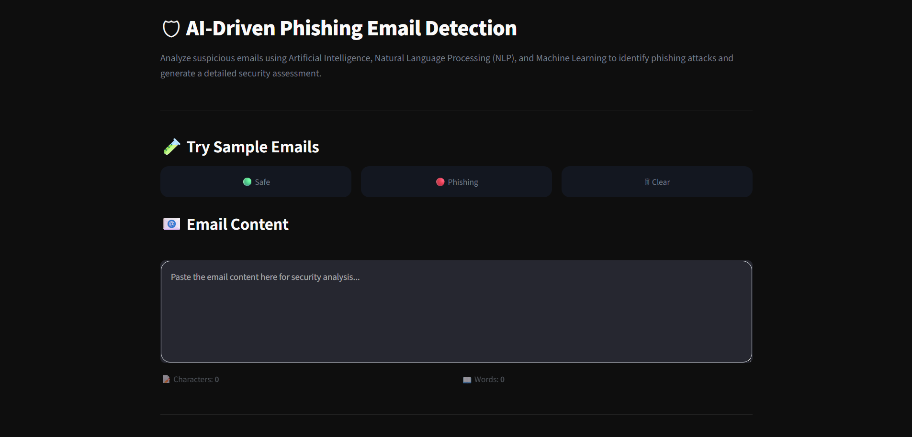
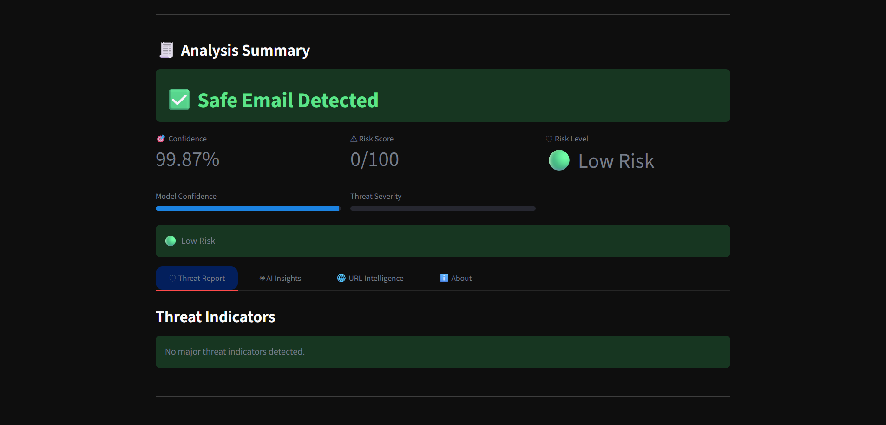
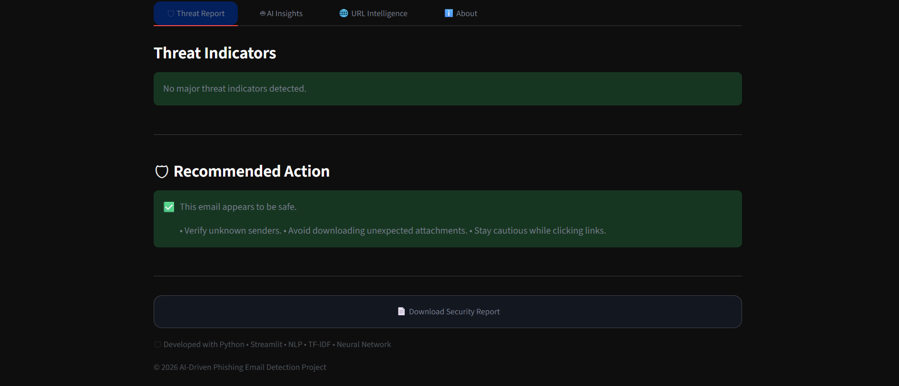

# 🛡 AI-Driven Phishing Email Detection Using NLP

An AI-powered cybersecurity application that detects phishing emails using **Natural Language Processing (NLP)** and **Machine Learning**.

The application analyzes email content, identifies phishing indicators, evaluates potential security threats, performs URL analysis, generates AI-powered explanations, and generates a downloadable PDF security report through an interactive Streamlit interface.

---

## ✨ Features

- 📧 AI-powered phishing email detection
- 🧠 Neural Network-based email classification
- 🔤 Advanced text preprocessing and cleaning
- 📑 TF-IDF feature extraction
- 📊 Confidence score prediction
- ⚠️ Risk score generation
- 🛡 Threat indicator analysis
- 🤖 Explainable AI insights
- 🌐 URL security analysis
- 📄 Downloadable PDF security report
- 🎨 Modern and responsive Streamlit UI
- 🧪 Built-in Safe & Phishing sample emails

---

# 📸 Application Preview

## 🏠 Home Page



---

## 🚨 Detection Result



---

## 🛡 Threat Analysis



---

## 🌐 URL Intelligence


---

# 🛠 Tech Stack

| Category             | Technology                     |
| -------------------- | ------------------------------ |
| Programming Language | Python                         |
| Framework            | Streamlit                      |
| Machine Learning     | Scikit-learn                   |
| NLP                  | TF-IDF Vectorizer              |
| Model                | Neural Network (MLPClassifier) |
| Data Processing      | Pandas, NumPy                  |
| Model Serialization  | Joblib                         |
| PDF Generation       | ReportLab                      |

---

# 📂 Project Structure

```text
AI_Phishing_Email_Detection/
│
├── app.py
├── main.py
├── README.md
├── requirements.txt
├── .gitignore
│
├── assets/
│   ├── home.png
│   ├── prediction.png
│   ├── threat_report.png
│   ├── url_analysis.png
│   └── styles.css
│
├── dataset/
│   └── Phishing_Email.csv
│
├── models/
│   ├── neural_network.pkl
│   ├── tfidf_vectorizer.pkl
│   └── label_encoder.pkl
│
├── modules/
│   ├── data_cleaning.py
│   ├── data_collection.py
│   ├── feature_engineering.py
│   ├── model_development.py
│   ├── evaluation.py
│   ├── threat_analysis.py
│   ├── explainability.py
│   └── url_analysis.py
│
├── outputs/
│   └── plots/
│
└── utils/
    ├── ui.py
    └── report.py
```

---

# ⚙ Installation

Clone the repository

```bash
git clone https://github.com/shrinepakhredia-ui/AI-Phishing-Email-Detection-Using-NLP.git
```

Move into the project directory

```bash
cd AI-Phishing-Email-Detection-Using-NLP
```

Install dependencies

```bash
pip install -r requirements.txt
```

Run the application

```bash
streamlit run app.py
```

---

# ▶️ How to Use

1. Launch the Streamlit application.
2. Paste an email or load a sample email.
3. Click **Analyze Email**.
4. Review:
   - Prediction Result
   - Confidence Score
   - Risk Score
   - Threat Report
   - AI Insights
   - URL Intelligence
5. Download the generated PDF Security Report.

---

# 🚀 Future Improvements

- Email (.eml) file upload support
- Gmail email header analysis
- SPF / DKIM / DMARC validation
- VirusTotal API integration
- Google Safe Browsing API
- Domain WHOIS analysis
- IP reputation checking
- Docker deployment

---

# 👨‍💻 Author

**Shrine Pakhredia**

B.Tech – Artificial Intelligence & Machine Learning

GitHub: https://github.com/shrinepakhredia-ui

---

⭐ If you found this project useful, consider giving it a star!
